# FinanceFlow
An agentic application that extracts and processes transaction data from natural language and allows for intuitive querying. This project is aimed at small business needs, but it can also be used by individuals for managing personal finance.

## Presentation Slides
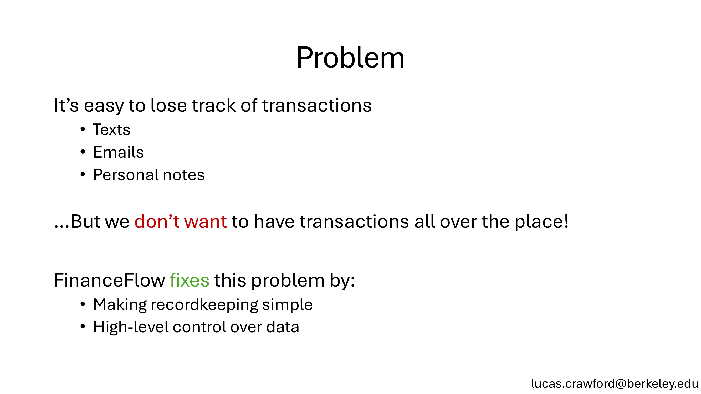
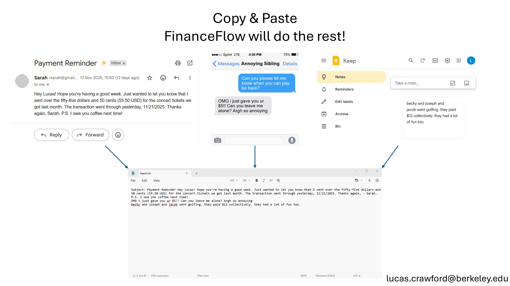
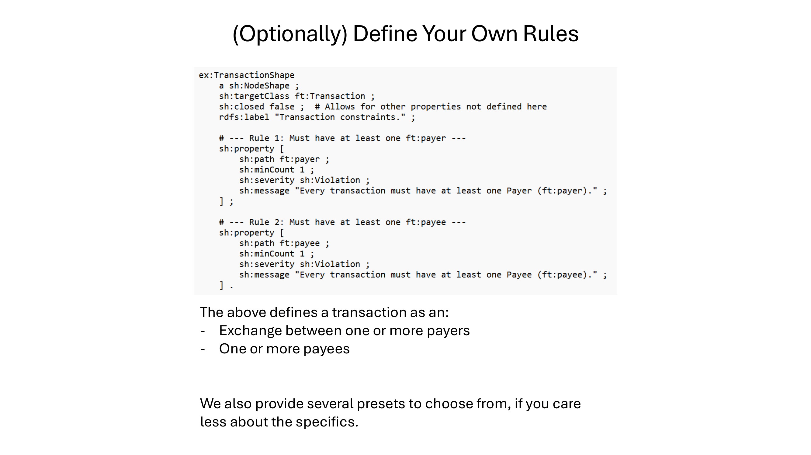
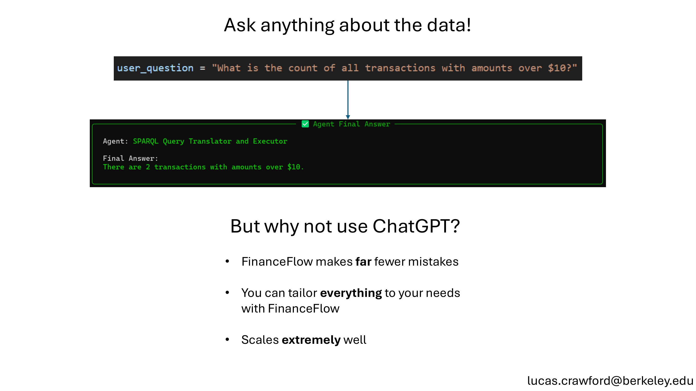
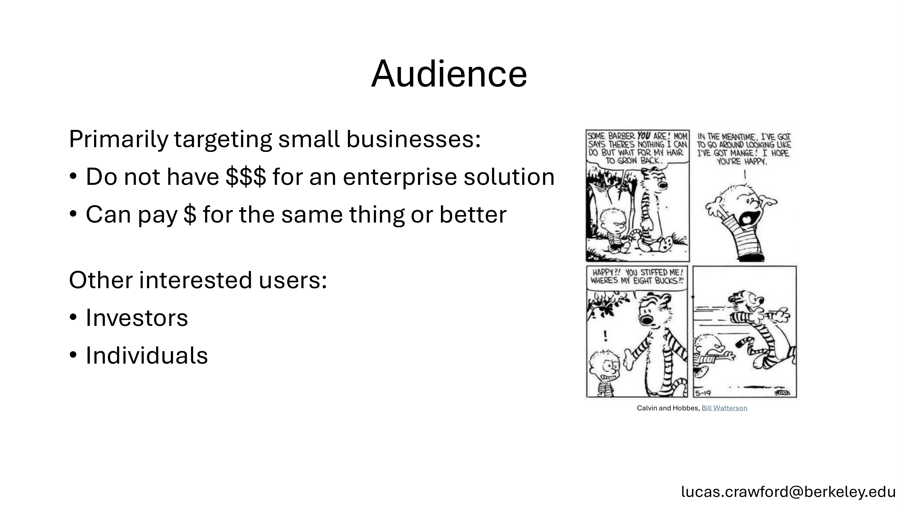
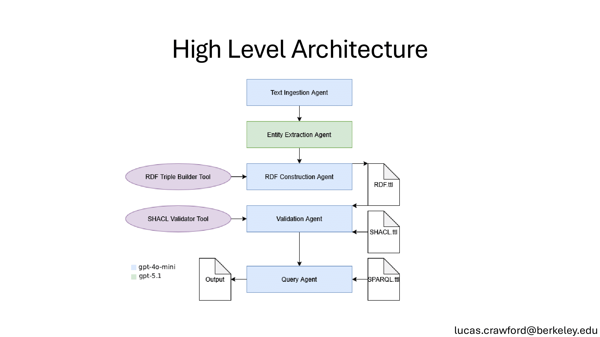
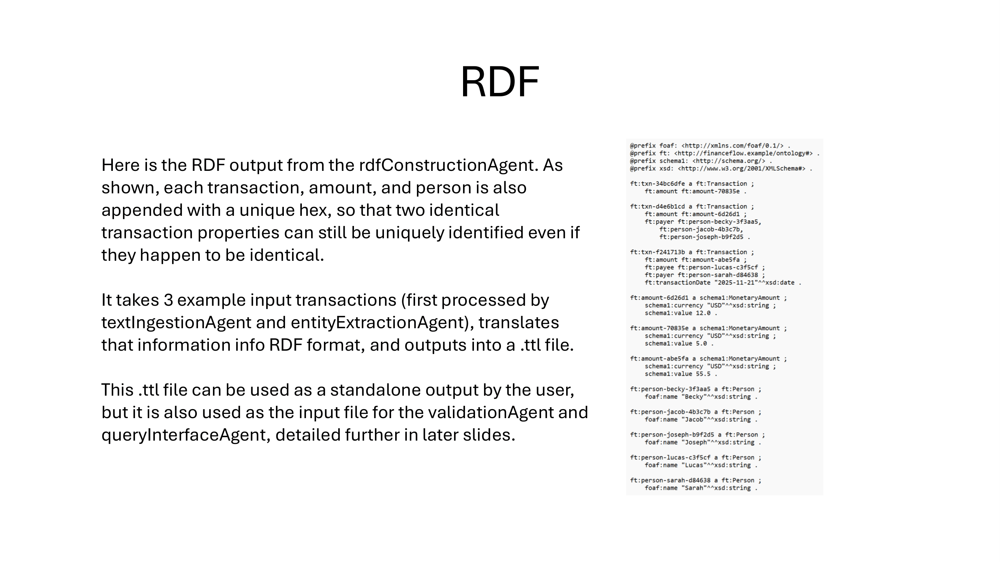
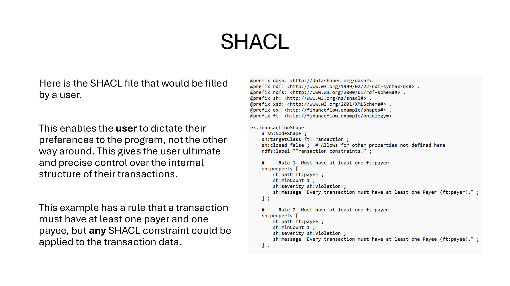
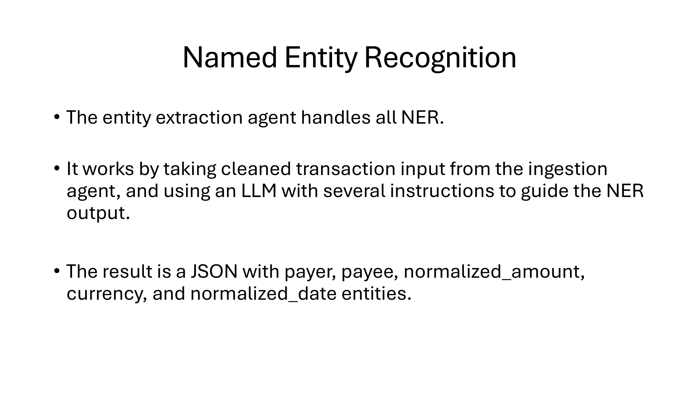
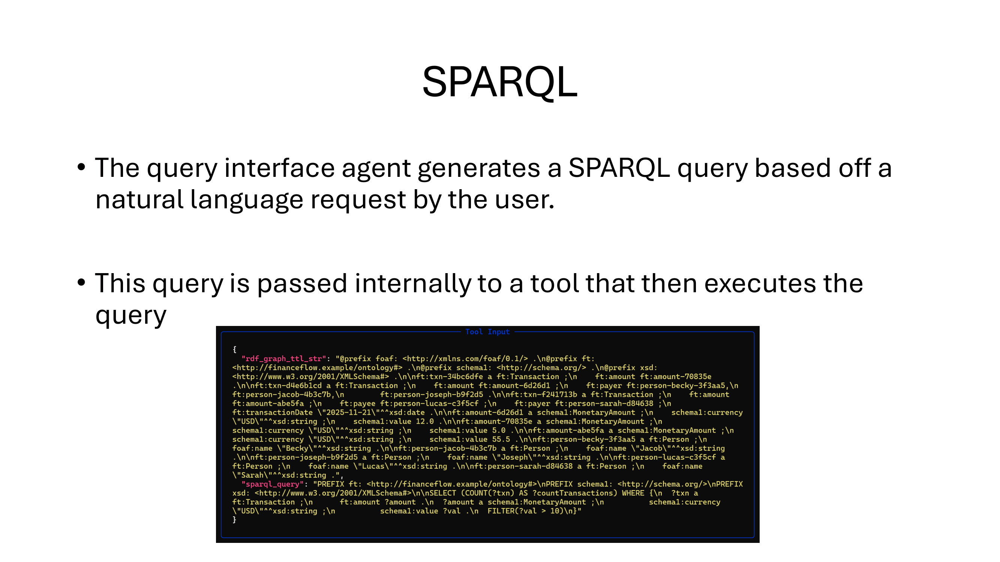
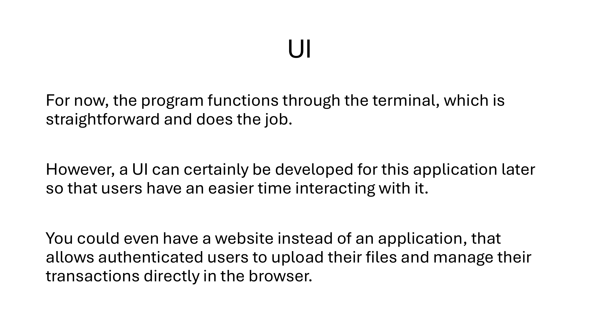
